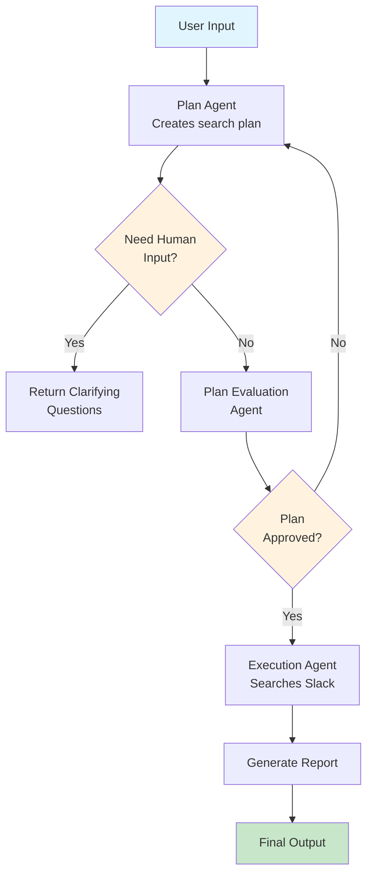

# Agent Workflow Diagram

## Workflow Components

### Main Flow
1. **User Input**: User asks a question about Slack conversations
2. **Plan Agent**: Creates search strategy and identifies relevant channels
3. **Human Input Check**: Returns clarifying questions if query is ambiguous
4. **Plan Evaluation**: Reviews and validates the search plan
5. **Execution Agent**: Performs Slack searches and analyzes results
6. **Final Output**: Returns structured report with findings

### Key Features
- **Smart Planning**: Converts queries into targeted search strategies
- **Channel Selection**: Identifies relevant Slack channels automatically
- **Dual Search**: Performs both global and channel-specific searches
- **Structured Reports**: Returns findings in organized Markdown format
